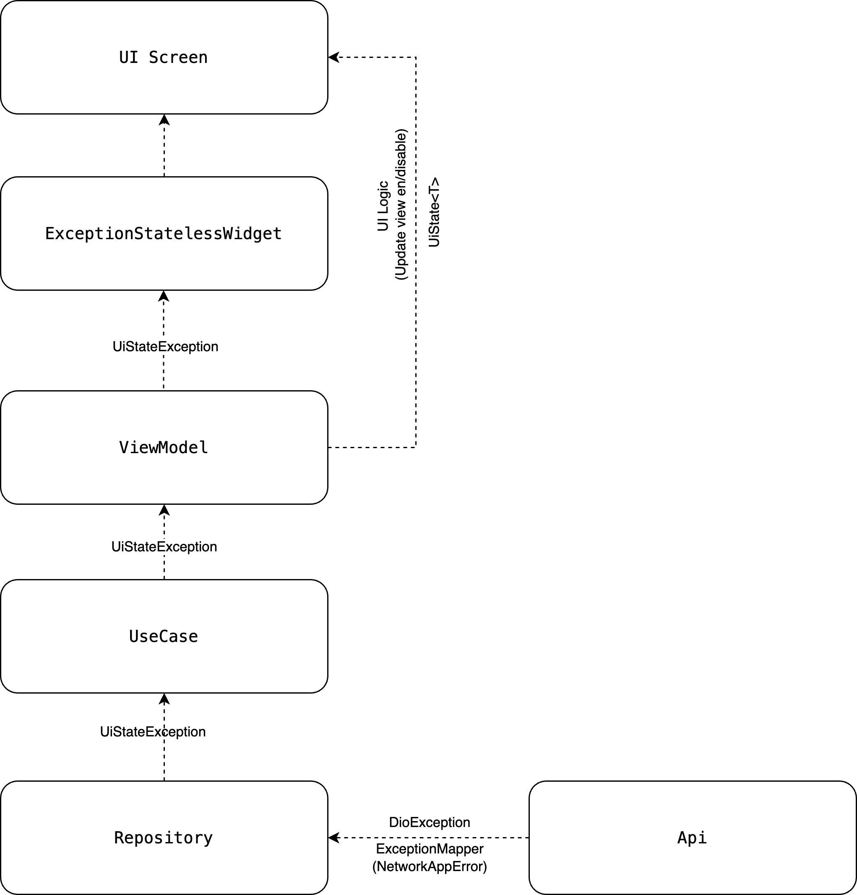

# Exception Flow Learning Journey

In this learning journey you will learn about the Exception Flow architecture: types, mapper and executor exception on base ui class.

## Goals and requirements

The goals for the exception flow architecture are:

*   Handle common errors from the API
*   Handle errors from business logic.
*   Handle errors from the UI layer.
*   Executor on base ui class.

## Flow overview

